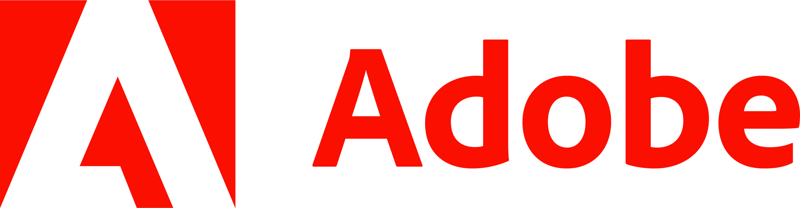
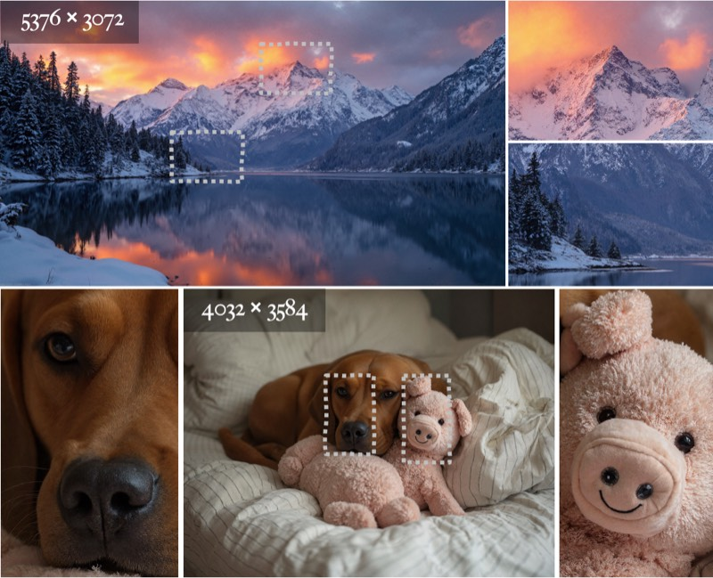
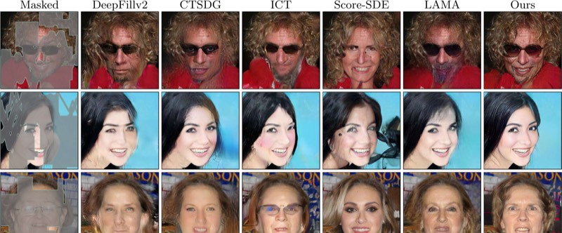
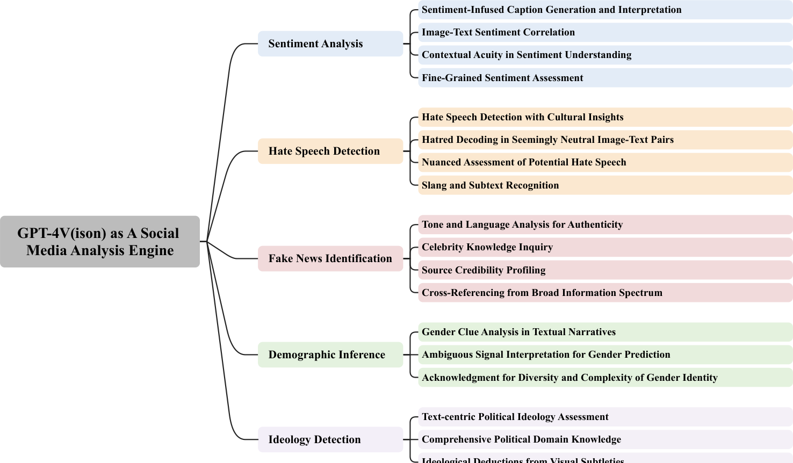

## News

02/2026

<a href="https://arxiv.org/pdf/2511.20645">PixelDiT</a> is accepted to <a href="https://cvpr.thecvf.com/">CVPR 2026</a> Oral

12/2025

I will serve as an Area Chair for <a href="https://eccv.ecva.net/">ECCV 2026</a>.

11/2025

<a href="https://ojs.aaai.org/index.php/AAAI/article/view/38211">RealUHR</a> is accepted to <a href="https://aaai.org/conference/aaai/aaai-26/">AAAI 2026</a>.

09/2025

<a href="https://neurips.cc/virtual/2025/loc/san-diego/poster/116617">PixPerfect</a> is accepted to <a href="https://neurips.cc/Conferences/2025">NeurIPS 2025</a>.

06/2025

<a href="https://arxiv.org/abs/2503.08677">OmniPaint</a> is accepted to <a href="https://iccv.thecvf.com/">ICCV 2025</a>.

04/2025

32×-compressed latent SR model <a href="https://arxiv.org/pdf/2504.08591">ZipIR</a> report is available! (Completed Nov 2024, delayed release due to patent application)

09/2024

<a href="https://arxiv.org/abs/2405.16785">PromptFix</a> is accepted to <a href="https://neurips.cc/Conferences/2024">NeurIPS 2024</a>.

01/2024

MaGIC is accepted to <a href="https://iclr.cc/">ICLR 2024</a>.

<a class="news-toggle" id="news-toggle" onclick="document.getElementById('news-list').classList.toggle('expanded');var t=this;t.textContent=t.textContent==='Show more'?'Show less':'Show more';">Show more</a>

<!-- 

07/2022

Two papers accepted to <a href="https://eccv2022.ecva.net/">ECCV 2022</a>.

 -->

## Experience

  

    
    

      

        
<a href="https://www.nvidia.com/en-us/">NVIDIA</a>

        
May 2025 - Present

      

      
Research Intern · Santa Clara, US

    

  

  

    
    

      

        
<a href="https://research.adobe.com/">Adobe Research</a>

        
May 2024 - Apr 2025

      

      
Research Intern · San Jose, US

    

  

  

    
    

      

        
<a href="https://www.microsoft.com/en-us/research/lab/microsoft-research-asia/">Microsoft Research Asia</a>

        
May 2023 - Aug 2023

      

      
Research Intern · Beijing, China

    

  

## Selected Publications

CVPR 2026 Oral

<a href="https://arxiv.org/pdf/2511.20645">PixelDiT: Pixel Diffusion Transformers for Image Generation</a>

<strong>Yongsheng Yu</strong>, Wei Xiong, Weili Nie, Yichen Sheng, Shiqiu Liu, Jiebo Luo

IEEE/CVF Conference on Computer Vision and Pattern Recognition (CVPR), 2026, Oral

<a href="https://pixeldit.github.io/"><i class="fas fa-globe"></i> Project</a>
<a href="https://arxiv.org/pdf/2511.20645"><i class="fas fa-file-pdf"></i> PDF</a>

AAAI 2026

<a href="https://ojs.aaai.org/index.php/AAAI/article/view/38211">RealUHR: Harnessing Patch-Cascade Flows for Photorealistic Ultra-High-Resolution Synthesis</a>

<strong>Yongsheng Yu</strong>, Haitian Zheng, Zhe Lin, Connelly Barnes, Yuqian Zhou, Zhifei Zhang, Jiebo Luo

AAAI Conference on Artificial Intelligence (AAAI), 2026

<a href="https://ojs.aaai.org/index.php/AAAI/article/download/38211/42173"><i class="fas fa-file-pdf"></i> PDF</a>

ICCV 2025 

<a href="https://arxiv.org/abs/2503.08677">OmniPaint: Mastering Object-Oriented Editing via Disentangled Insertion-Removal Inpainting</a>

<strong>Yongsheng Yu</strong>*&dagger;, Ziyun Zeng*, Haitian Zheng, Jiebo Luo

&dagger; Project lead

IEEE/CVF International Conference on Computer Vision (ICCV), 2025

<a href="https://www.yongshengyu.com/OmniPaint-Page/"><i class="fas fa-globe"></i> Project</a>
<a href="https://arxiv.org/pdf/2503.08677"><i class="fas fa-file-pdf"></i> PDF</a>
<a href="https://github.com/yeates/OmniPaint"><i class="fab fa-github"></i> Code</a>

IJCV 2025

<a href="https://arxiv.org/abs/2504.12844">High-Fidelity Image Inpainting with Multimodal Guided GAN Inversion</a>

Libo Zhang*, <strong>Yongsheng Yu</strong>*, Jiali Yao, Heng Fan

International Journal of Computer Vision (IJCV), 2025

<a href="https://arxiv.org/pdf/2504.12844"><i class="fas fa-file-pdf"></i> PDF</a>

ACM TIST 2025

<a href="https://arxiv.org/abs/2311.07547">GPT-4V(ision) as A Social Media Analysis Engine</a>

Hanjia Lyu*, Jinfa Huang*, Daoan Zhang*, <strong>Yongsheng Yu</strong>*, Xinyi Mou*, et al.

ACM Transactions on Intelligent Systems and Technology (TIST), 2025

<a href="https://arxiv.org/pdf/2311.07547"><i class="fas fa-file-pdf"></i> PDF</a>

arXiv 2504.08591

<a href="https://arxiv.org/abs/2504.08591">ZipIR: Latent Pyramid Diffusion Transformer for High-Resolution Image Restoration</a>

<strong>Yongsheng Yu</strong>, Haitian Zheng, Zhifei Zhang, Jianming Zhang, Yuqian Zhou, Connelly Barnes, Yuchen Liu, Wei Xiong, Zhe Lin, Jiebo Luo

arXiv preprint, 2025

<a href="https://arxiv.org/pdf/2504.08591"><i class="fas fa-file-pdf"></i> PDF</a>

NeurIPS 2024 

<a href="https://arxiv.org/abs/2405.16785">PromptFix: You Prompt and We Fix the Photo</a>

<strong>Yongsheng Yu</strong>*&dagger;, Ziyun Zeng*, Hang Hua, Jianlong Fu, Jiebo Luo

&dagger; Project lead

Annual Conference on Neural Information Processing Systems (NeurIPS), 2024

<a href="https://www.yongshengyu.com/PromptFix-Page/"><i class="fas fa-globe"></i> Project</a>
<a href="https://arxiv.org/pdf/2405.16785"><i class="fas fa-file-pdf"></i> PDF</a>
<a href="https://github.com/yeates/PromptFix"><i class="fab fa-github"></i> Code</a>
<a href="https://huggingface.co/datasets/yeates/PromptfixData"><i class="fas fa-database"></i> Dataset</a>

ICLR 2024

<a href="https://arxiv.org/abs/2305.11818">MaGIC: Multi-modality Guided Image Completion</a>

Hao Wang*, <strong>Yongsheng Yu</strong>*&dagger;, Tiejian Luo, Heng Fan, Libo Zhang

&dagger; Project lead

International Conference on Learning Representations (ICLR), 2024

<a href="https://arxiv.org/pdf/2305.11818.pdf"><i class="fas fa-file-pdf"></i> PDF</a>
<a href="https://yeates.github.io/MaGIC-Page"><i class="fas fa-globe"></i> Project</a>
<a href="https://github.com/yeates/MaGIC"><i class="fab fa-github"></i> Code</a>

ICME 2024

<a href="https://arxiv.org/pdf/2405.15687">Chain-of-Thought Prompting for Demographic Inference with Large Multimodal Models</a>

<strong>Yongsheng Yu</strong>, Jiebo Luo

IEEE International Conference on Multimedia and Expo (ICME), 2024, Oral

<a href="https://arxiv.org/pdf/2405.15687"><i class="fas fa-file-pdf"></i> PDF</a>

arXiv 2307.08629

<a href="https://arxiv.org/abs/2307.08629">Deficiency-Aware Masked Transformer for Video Inpainting</a>

<strong>Yongsheng Yu</strong>, Heng Fan, Libo Zhang, Jiebo Luo

arXiv preprint, 2023

<a href="https://arxiv.org/pdf/2307.08629.pdf"><i class="fas fa-file-pdf"></i> PDF</a>
<a href="https://github.com/yeates/DMT"><i class="fab fa-github"></i> Code</a>

ECCV 2022

<a href="https://arxiv.org/abs/2208.11844">Unbiased Multi-Modality Guidance for Image Inpainting</a>

<strong>Yongsheng Yu</strong>, Dawei Du, Libo Zhang, Tiejian Luo

European Conference on Computer Vision (ECCV), 2022

<a href="https://arxiv.org/abs/2208.11844"><i class="fas fa-file-pdf"></i> PDF</a>
<a href="https://github.com/yeates/MMT"><i class="fab fa-github"></i> Code</a>

ECCV 2022

<a href="https://arxiv.org/abs/2208.11850">High-Fidelity Image Inpainting with GAN Inversion</a>

<strong>Yongsheng Yu</strong>, Libo Zhang, Heng Fan, Tiejian Luo

European Conference on Computer Vision (ECCV), 2022

<a href="https://arxiv.org/abs/2208.11850"><i class="fas fa-file-pdf"></i> PDF</a>

## Services

<table class="service-table">
<tr><td class="service-key">Area Chair</td><td>ECCV 2026</td></tr>
<tr><td class="service-key">Conference Reviewer</td><td>
2026: CVPR, AAAI 
2025: CVPR, ICCV, ICLR, NeurIPS, AAAI, MM 
2024: CVPR, ECCV, ICML, ICLR, NeurIPS, ICME, MM, WACV 
2023: CVPR, ICCV, NeurIPS, WACV</td></tr>
<tr><td class="service-key">Journal Reviewer</td><td>IEEE TIP, IJCV, IEEE TMM</td></tr>
</table>

<!-- ClustrMaps (hidden, analytics only) -->

